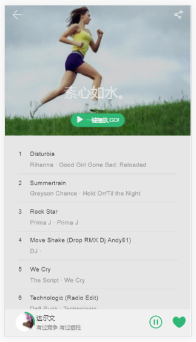
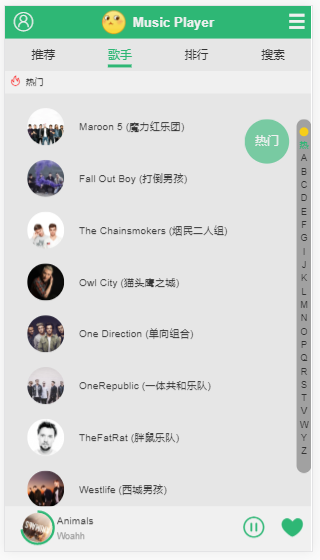
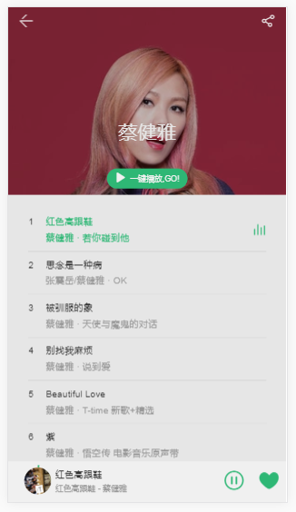
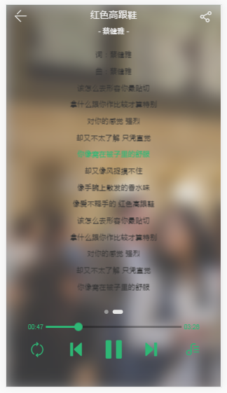
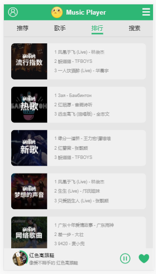
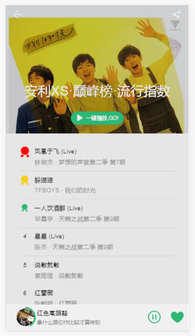
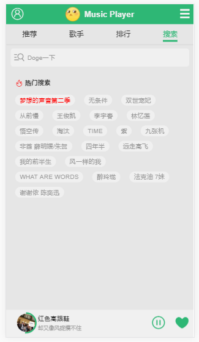
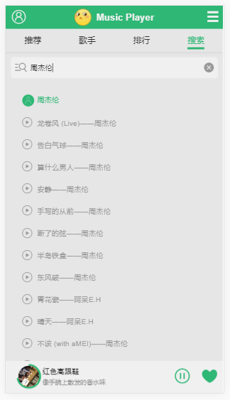
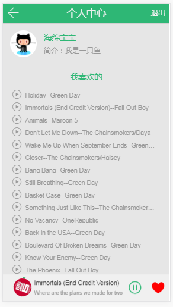

# Music Player

> 基于Vue的音乐播放器

> 说明：QQ音乐播放源时常更改，因此示例中的歌曲可能无法播放

<p align="center">
  <a href="https://github.com/vuejs/vue"></a>
  <a href="https://github.com/vuejs/vue-router"></a>
  <a href="https://github.com/vuejs/vuex"></a>
  <a href="https://github.com/hilongjw/vue-lazyload"></a> 
  <a href="https://github.com/axios/axios"></a>
  <a href="https://github.com/ustbhuangyi/better-scroll"></a>
  <a href="https://github.com/ftlabs/fastclick"></a>
  <a href="https://github.com/stylus/stylus"></a>
</p>

### 手机扫一扫预览：


### 一、播放器基本功能
- [x] 歌曲播放、切歌、进度控制
- [x] 三种播放模式的切换
- [x] 搜索歌手、歌曲
- [x] 上拉加载功能
- [x] 模拟登录跳转
- [x] 收藏歌曲


### 二、概述
- 下面图片可以看出，有许多页面采用了复用的组件，比如推荐歌单页（图2）、歌手详情页（图4）、排行榜详情页（图8），同时在这些组件中还有更加细分的基础组件。这样可以高度定制化组件，满足不同的需求，提高开发效率。
- 核心是利用vuex做数据的传递，方便跟踪状态
- Vue-Router实现单页面路由跳转
- Vue-lazyLoad实现图片懒加载
- fastclick解决移动端300ms延迟
- 对搜索框搜索功能进行了节流，减少请求节约流量
- 使用vue提供的异步组件配合webpack的代码分割实现路由懒加载
- (2017.12.29新增)利用路由元信息的meta字段，通过watch $route动态改变transition的name，实现合理的动态路由切换过渡动画
- (2017.12.30新增)利用localStorage实现收藏歌曲功能，且该功能需在登录状态下操作(未登录时点击收藏按钮会自动跳转登录页)

> * 这个播放器依然有许多隐藏的bug，还有许多功能待完善，抱着学习的态度我会一直更新完善它。

### 三、图片预览
##### 1.首页


##### 2.推荐歌单页


##### 3.歌手页


##### 4.歌手详情页


##### 5.播放器



##### 6.排行榜


##### 7.排行榜详情页


##### 8.搜索页


##### 9.搜索结果


##### 10.个人中心


### 四、项目结构

```text
│  App.vue                  //组件入口
│  main.js                  //js入口
│  
├─api                       //获取数据的文件
│      config.js                //公共配置
│      deslist.js               //热门歌单数据
│      lyric.js                 //歌词数据
│      rank.js                  //排行榜数据
│      rankDetail.js            //榜单详情数据
│      recommend.js             //轮播图数据
│      recommendDetail.js       //热门歌单详情数据
│      result.js                //搜索结果数据
│      search.js                //热搜关键词数据
│      singerdetail.js          //歌手详情数据
│      singerlist.js            //歌手列表数据
│      
├─baseComponents            //公用基础组件
│  ├─cannotfind                 
│  │      cannotfind.vue        //搜索结果为空
│  │      
│  ├─circleProgress
│  │      circleProgress.vue    //环形进度条
│  │      
│  ├─input
│  │      input.vue             //搜索框
│  │      
│  ├─loading
│  │      loading.svg
│  │      loading.vue           //加载中
│  │      
│  ├─music
│  │      music.vue             //歌单列表
│  │      
│  ├─progress
│  │      progress.vue          //进度条
│  │      
│  ├─scroll
│  │      scroll.vue            //better-scroll的封装
│  │      
│  ├─slider
│  │      slider.vue            //轮播图
│  │      
│  └─songRank
│          songrankcomplex.vue  //榜单歌曲排序
│          songranksimple.vue   //普通歌曲排序
│          
├─common                    //js工具库、样式、字体
│  ├─iconfont
│  │      demo.css
│  │      demo_fontclass.html
│  │      demo_symbol.html
│  │      demo_unicode.html
│  │      iconfont.css
│  │      iconfont.eot
│  │      iconfont.js
│  │      iconfont.svg
│  │      iconfont.ttf
│  │      iconfont.woff
│  │      
│  ├─js
│  │      config.js             //项目相关配置
│  │      dom.js                //DOM操作方法
│  │      jsonp.js              //jsonp的封装
│  │      mixins.js             //vue提供的复用功能
│  │      prefixStyle.js        //js中操作DOM添加前缀
│  │      singer.js             //Singer类
│  │      song.js               //Song类
│  │      localstorage.js       //自制vue的localstorage插件
│  │      utils.js              //函数工具库
│  │      
│  └─stylus                 //stylus文件
│          base.styl
│          index.styl
│          mixin.styl
│          myicon.styl
│          reset.styl
│          variable.styl
│          
├─components                //业务组件
│  ├─header             
│  │      header.vue            //公用头部
│  │      logo@2y.png
│  │      logo@3y.png
│  │      
│  ├─player                     
│  │      player.vue            //播放器组件
│  │      
│  ├─rank                       
│  │      rank.vue              //排行榜组件
│  │      
│  ├─rankDetail
│  │      rankDetail.vue        //排行榜详情组件
│  │      
│  ├─recommend
│  │      recommend.vue         //首页
│  │      
│  ├─recommendDetail
│  │      recommendDetail.vue   //首页详情组件
│  │      
│  ├─result
│  │      result.vue            //搜索结果组件
│  │      
│  ├─search
│  │      search.vue            //搜索页组件
│  │      
│  ├─singer
│  │      singer.vue            //歌手列表组件
│  │      
│  ├─singerDetail
│  │      singerDetail.vue      //歌手详情组件
│  │      
│  ├─song
│  │      song.vue              //歌曲组件
│  │
│  ├─login
│  │      login.vue             //登录组件
│  │      
│  ├─person
│  │      person.vue            //个人中心     
│  └─tab
│          tab.vue              //头部导航组件
│          
├─router                    //路由配置
│      index.js
│      
└─vuex                      //vuex配置
        actions.js              //dispatch
        getters.js              //计算state数据
        index.js                //vuex入口
        mutations-types.js      //mutations常量
        mutations.js            //commit
        state.js                //基础数据
```


### 五、主要问题及解决方式

**起步**：

Init the project by vue-cli(installed the dependencies by cnpm)，and install babel-polyfill in dev-environment in order to compile es6'api(Array.from(),Object.assign()...) to javascript, also, installed babel-runtime and fastclick in pro-environment which the latter one is provided to solve "300ms delay" in mobile. 

**问题清单**:

I got many troubles in doing this project,and now i would list them to remind me that i shoudn't be struggled in the same troubles again.
##### Q1:

> * To obtain the data of QQ music, i need to use jsonp,but there is no way to get a more friendly API on GitHub, So i considered to create a more friendly API of JSONP:
```javascript
    import originJsonp from 'jsonp'
//based on https://github.com/webmodules/jsonp
export default function jsonp(url, data, option) {
  url += (url.indexOf('?') < 0 ? '?' : '&') + param(data)

  return new Promise((resolve, reject) => {
    originJsonp(url, option, (err, data) => {
      if (!err) {
        resolve(data)
      } else {
        reject(err)
      }
    })
  })
}

export function param(data) {
  let url = ''
  for (var k in data) {
    let value = data[k] !== undefined ? data[k] : ''
    url += '&' + k + '=' + encodeURIComponent(value)
  }
  return url ? url.substring(1) : ''
}
```
##### Q2:
> * I use better-scroll to build my slider component,but the first question i found was that the slider component can't be rendered rightly.this problem was caused by :the slider component has been mounted before got the silder data with JSONP(async progress). so, in recommend component i need to add a judgment:
```html
<!-- 获取图片数据是异步的，拿到数据前slider组件已经被mounted，不能正确渲染，需要如下判断 -->
<!--recommends.length表示是否获取到数据-->
   	<div v-if="recommends.length" class="slider-wrapper">
   		<slider>
   			<div v-for="item in recommends">
   				<a :href="item.linkUrl">
   					
   				</a>
   			</div>
   		</slider>
   	</div>
```
##### Q3:
> * When import function that exported from recommend.js, it shows: `TypeError: Object(...) is not a function`,so i changed the way to export by not using `default`,and divide the functions into 2 js files,and troubles was dealed
##### Q4:
> * When i got data of singers by JSONP,i found that the Data structure wasn't what i need. So i have to transform the structure by a series of ways into a two-dimensional Array. To be honest,it tooks me a lots of time,but any way,it deservered.
##### Q5:
> * When i click the buttons of nextSong and prevSong to switch the currentSong,it shows error:`vue.runtime.esm.js?b7b3:6240 Uncaught (in promise) DOMException: The play() request was interrupted by a new load request`.I found that it's because the source of the song was not ready,so i designed an onoff to promise the songs can be played only when it's src is loaded,like this:
```html
<!--媒体标签的自带方法-->
<audio ref="audio" :src="currentSong.url" @canplay="canplay" @error="error" @timeupdate="_currentTime"></audio>
```
```js
canplay(){  //标识：歌曲canplay时置为true
    this.canBePlayed = true
},
error(){  //防止加载歌曲出错时播放器挂起
    this.canBePlayed = true
}

nextSong(){
    if( !this.canBePlayed ) { return }

    let index = this.currentIndex + 1
    if( index === -1 ) { index = this.playList.length - 1 }
    this.setCurrentIndex(index) 

    this.canBePlayed = false 
}
```
##### Q7:
> * 由于部分数据Host字段的限制，不能直接通过JSONP获取歌词数据，开发环境下采用后端代理来获取（生产环境需要另作修改）

- 1.首先，对获取歌词数据的方法做出修改
```js
//获取数据的文件
import axios from 'axios'
import {commonParams, options} from './config'
export default function getLyric(mid){
    //把正常请求的地址换为约定的后端代理地址
    const url = '/api/getLyric'
	// 把公共参数和其他参数合并
	const data = Object.assign( {}, commonParams, {
		pcachetime: + new Date() ,
		songmid: mid,
		g_tk: 5381,
		loginUin: 0,
		hostUin: 0,
		format: 'json',
		platform:' yqq',
		needNewCode: 0
	})
	return axios.get( url, {
		params: data
	} ).then( (res) => {
		return Promise.resolve( res.data )
	} )
}
```
- 2.在webpack-dev-conf.js中添加以下逻辑即可
```js
let express = require('express')
let axios = require('axios')
let app = express()
let apiRoutes = express.Router()
app.use('/api', apiRoutes)
//找到devServer后在里面添加以下内容
    before(app){
      app.get( '/api/getLyric', function(req, res) {
      //这里是正常请求的地址
        const url = 'https://c.y.qq.com/lyric/fcgi-bin/fcg_query_lyric_new.fcg'
        //通过axios在nodejs中发送HTTP请求时，带上指定的headers以及params
        axios.get( url, {
          headers: {
            referer: 'https://y.qq.com/',
            host: 'c.y.qq.com'
          },
          params: req.query
        } ).then((response) => {
          // res.json(response.data)
          //得到的歌词数据是JSONP形式，需要将其转为JSON
          var ret = response.data
          if (typeof ret === 'string') {
            var reg = /^\w+\(({[^()]+})\)$/
            var matches = ret.match(reg)
            if (matches) {
              ret = JSON.parse(matches[1])
            }
          }
          res.json(ret)
        } ).catch((err) => {
          console.log(err)
        })
      } )
```

##### Q8:
> * During developing the search component, i met a trouble that: it can't send request when i enter the character in input first time Whether the character is a letter or a singer word. And then i found it was caused by the props:
```html
<!--<div class="hotkey-wrapper" v-if="!searchTxt">-->
<div class="hotkey-wrapper" v-show="!searchTxt">
<div class="shortcut">
	<div class="hotkey">
		<i class="icon-huo"></i>
			<h1 class="title">热门搜索</h1>
				<ul>
					<li @click="selectItem(item.k, index)" class="item" 
							v-for="item,index in hotKey"				:class="{hightLight: index === 0}"
						>{{item.k}}</li>
				</ul>
			</div>
		</div>
	</div>
<!--<div class="search-result" v-else>-->
<div class="search-result" v-show="searchTxt">
	<result :searchTxt="searchTxt"></result>
</div>
```
**The key problem was that i used v-if and v-else ,by the first time i entered the character, the `<div class="search-result"></div>` just created but it coundn't pass the props to `result component` unless entering the next time.**

##### Q9:
**歌手列表页左右联动效果：**

1、Init an object :`this.touch={}`,to record the touch details of right nav，when touchstart event happens,the place （e.touches[0].pageX）and data-index（索引，预先设置data-index） of touchstart should be recorded in this object

2、Doing the same things when touchmove event happens(通过移动的距离来计算索引，实现滚动到相应位置)

3、When scrolling the pages on left, we should watch the change of scrollY(在滚动页面时监听scrollY的变化，通过这一变化可以计算当前的currentIndex，再根据这个值来实现右侧导航的高亮)

##### Q10：
在开发歌曲列表基础组件时，下方的滚动区域无法正确设置top值从而覆盖图片，由于图片高度是随窗口大小而改变的，因此高度需要通过计算而来。而且由于图片加载需要时间，需要对上方图片区域预设一个高度，即:
```css
height: 0;
padding-top: 70%;
```
##### Q11：
为了实现收藏歌曲功能且能实时同步收藏歌单，收藏歌单列表在初始状态时利用localStorage里面的数据渲染（loveLists），在vuex里面的收藏歌单数据变化时（watch loveList）才用vuex里的数据渲染（loveList），这样能保证初始时个人中心化有数据且能够根据操作实时更新。

> * 这里总觉得用了点奇技淫巧，虽然功能实现了，但是感觉怪怪的，哈哈。。。

### 六、收获
尽管只是一个小的项目，但是我希望从中学到的不仅仅是如何制作这样一个播放器，更希望能够举一反三，把学到的知识运用到其它项目中，因此有必要对这一过程的学习进行总结

- 1.动手写代码之前先考虑好项目的组成，将其分成一个个块，在这些块当中，把功能类似的块抽象出来，做成公用的组件达到复用的目的
- 2.事先把数据接口全部分析一遍、找到其中的关联性，防止日后做无用功
- 3.养成良好的项目结构布局，一般来讲项目结构里面应该包含：基础组件、业务组件和函数工具库（个人积累的最好）
- 4.前端框架为我们提供了便捷地模块化开发，但无论是否使用框架，都要有模块化、组件化的开发思想
- 5.养成良好的代码习惯
- 6.边界条件的判断十分重要
- 7.对VUEX的理解：

WHAT：它是什么？
> vuex是vue提供的状态管理解决方案，能够对数据的改变进行跟踪

WHY: 为什么要用它？
> 当数据的传递变得复杂，单纯通过组件间的数据传递很难跟踪数据变化，维护起来也是噩梦

WHEN: 什么时候用它？
> 个人认为简单的父子通信通过props和自定义事件就可以做到，但是当通信组件之间并非简单的父子关系，数据流开始变得复杂，就需要派它上场了

